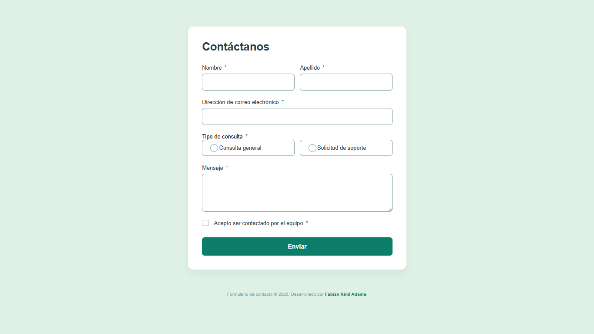
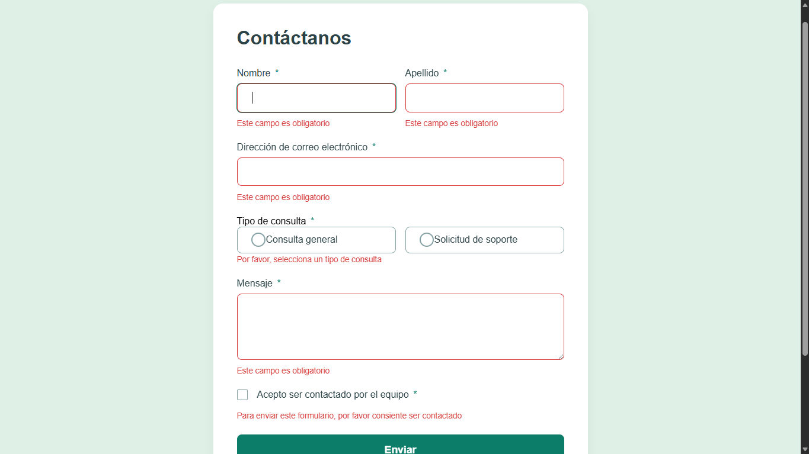
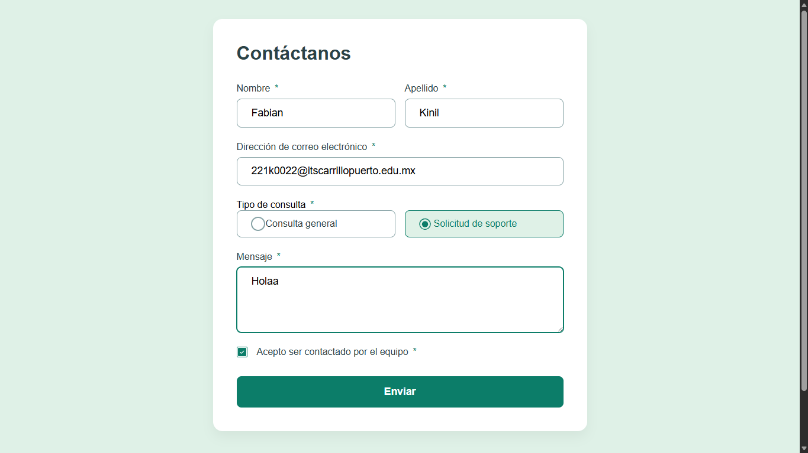
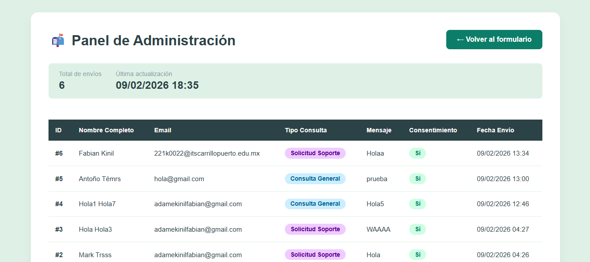
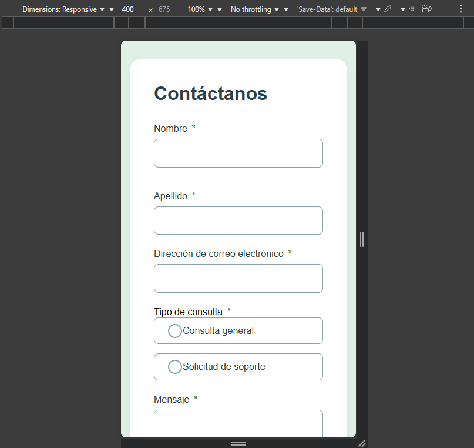
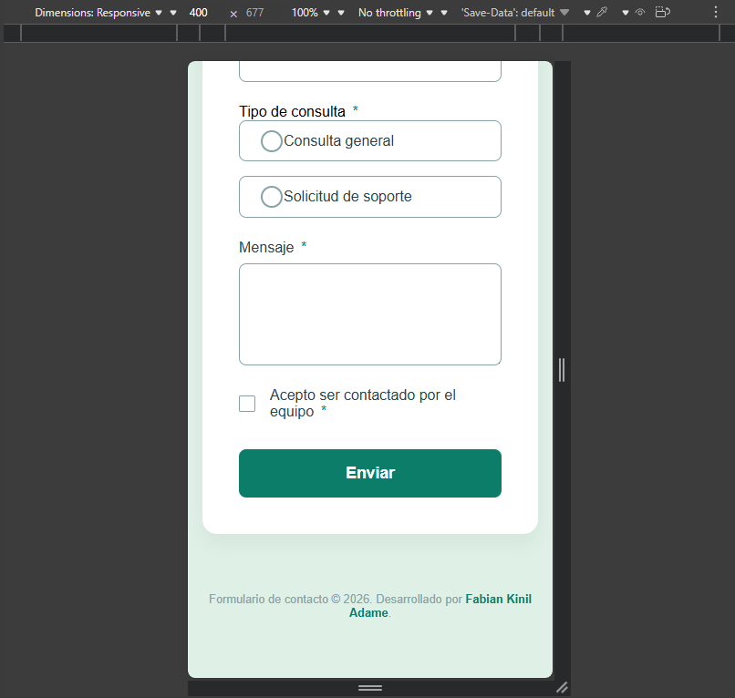

Solución del formulario de contacto

## Tabla de contenidos

- [Resumen](#resumen)
  - [Captura de pantalla](#captura-de-pantalla)
  - [Enlaces](#enlaces)
- [Autor](#autor)

## Resumen

Tu desafío es construir este formulario de contacto y lograr que se vea lo más cercano posible al diseño. Presta especial atención a hacer que este formulario sea accesible. Construir formularios accesibles es una habilidad clave para los desarrolladores front-end. 

Además de construir el frontend del formulario de contacto, también deberás implementar una parte de back-end para manejar el envío y recepción de información desde una base de datos. Así que este es un desafío perfecto para identificar el nivel de conocimiento en programacion web.

### El desafío

Tus usuarios deberían poder:

- Completar el formulario y ver un mensaje de éxito al enviarlo correctamente
- Recibir mensajes de validación del formulario si:
  - Se ha omitido un campo obligatorio
  - La dirección de correo electrónico no está correctamente formateada
- Completar el formulario solo usando su teclado
- Tener los inputs, mensajes de error y el mensaje de éxito anunciados en su lector de pantalla
- Ver el diseño óptimo para la interfaz dependiendo del tamaño de la pantalla de su dispositivo
- Ver estados de hover y focus para todos los elementos interactivos en la página
- Enviar el formulario y almacenar los datos en la base de datos.
- Recuperar y ver todos los envíos del formulario desde la base de datos.

Asegúrate de documentar tu configuración y cualquier instrucción especial para el uso o acceso al site del formulario  para que el docente puedan entender y ejecutar tu proyecto fácilmente.

## Configuración técnica del proyecto

### Configuración de Alojamiento (InfinityFree)

El proyecto fue desplegado utilizando el servicio de hosting gratuito **InfinityFree**, permitiendo alojar el frontend, backend y la base de datos MySQL en un entorno de producción real.

- **Creación de Base de Datos:**  
  Se creó una base de datos MySQL desde el panel de InfinityFree con el nombre técnico:  
  `if0_41117161_contact_form_db`.

- **Gestión de Archivos:**  
  Todos los archivos del proyecto (`index.php`, carpetas `css`, `js`, `assets` y `php`) fueron cargados en el directorio raíz del servidor denominado **`htdocs`**, que corresponde al punto de acceso público del sitio.

- **Importación de la Estructura:**  
  Se utilizó **phpMyAdmin** para ejecutar el script SQL que crea la tabla `envios`, permitiendo el almacenamiento persistente de los datos enviados desde el formulario.

- **URL de Producción:**  
  El sitio se encuentra completamente funcional y accesible en la siguiente dirección:  
  👉 https://fabian-kinil.infinityfree.me

---

### Configuración del archivo `php/db.php`

Para establecer la conexión entre el backend en PHP y el servidor MySQL remoto, se configuró el archivo `db.php` con las credenciales proporcionadas por InfinityFree.  
Este archivo funciona como el puente de comunicación entre la aplicación y la base de datos utilizando la extensión `mysqli`.

```php
<?php
// Credenciales de producción para el servidor remoto
$host = ""; // MySQL Hostname asignado por el panel
$user = "";            // MySQL Username específico de la cuenta
$password = "";       // Account Password de hosting
$dbname = "if0_41117161_contact_form_db"; // Nombre de la base de datos creada

// Conexión al servidor MySQL
$conn = mysqli_connect($host, $user, $password, $dbname);

// Verificación del estado de la conexión
if (!$conn) {
    die("Error de conexión: " . mysqli_connect_error());
}
?>
```


### Captura de pantalla










### Enlaces

- URL en GITHUB de tu proyecto:https://github.com/Fabian32f/formulario-contacto.git
- URL del site:[https://fabian-kinil.infinityfree.me]

## Autor
- Nombre completo: Fabian Kinil Adame
- N° Control: 221k0022
- Grupo: A
- Sitio  - [Formulario de Contacto](https://fabian-kinil.infinityfree.me)
- Github - [@Fabian32f](https://github.com/Fabian32f)